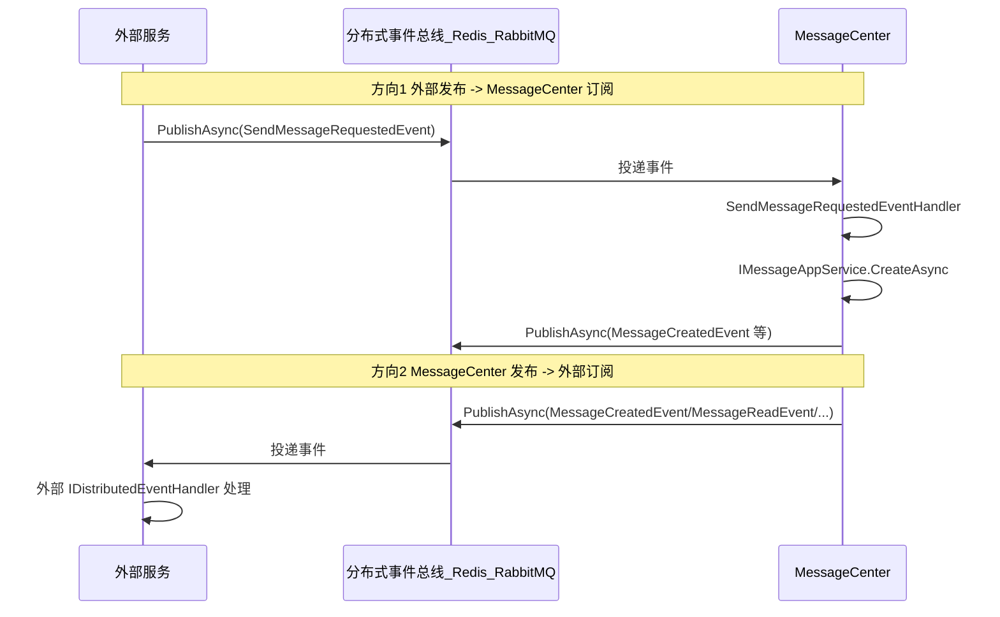

# 消息发布/订阅事件设计方案（外部服务 ↔ MessageCenter）

## 一、现状与目标

**当前架构要点：**

- **发布方**：MessageCenter 在 [MessageAppService](src/MessageCenter.Application/Services/MessageAppService.cs)、[MessageRealtimeService](src/MessageCenter.Application/Services/MessageRealtimeService.cs) 中通过 `IDistributedEventBus.PublishAsync` 发布事件（MessageCreatedEvent、MessageReadEvent、MessageDeletedEvent、MessageBatchCreatedEvent 等）。
- **订阅方（内部）**：Integration 层 [MessageCreatedEventHandler](src/MessageCenter.Integration/EventHandlers/MessageCreatedEventHandler.cs) 等实现 `IDistributedEventHandler<T>`，做 SignalR 推送。
- **订阅方（外部）**：[Backend-Integration-Guide.md](docs/Backend-Integration-Guide.md) 已说明外部模块如何实现 `IDistributedEventHandler<T>` 并依赖 `MessageCenterApplicationContractsModule` 订阅上述事件。
- **缺口**：  
  1. 没有「外部服务发布 → MessageCenter 订阅」的约定（例如：外部发布“请发消息”事件，MessageCenter 订阅并执行发消息）。
  2. 跨服务场景下事件总线（Redis/RabbitMQ）的配置未在文档中明确说明。
  3. `MessageFailedEvent` 已定义但未在代码中发布。

**设计目标：**

1. **外部发布 → MessageCenter 订阅**：定义“发消息请求”类事件，MessageCenter 订阅后调用 `IMessageAppService.CreateAsync`（或批量接口）执行发消息。
2. **MessageCenter 发布 → 外部订阅**：保持现有事件契约不变，在文档中明确跨服务订阅前提（同一事件总线 + Application.Contracts）。
3. **跨服务事件总线**：在文档中说明如何配置 Redis/RabbitMQ，使多服务共享同一事件总线。
4. **可选**：在发送失败路径发布 `MessageFailedEvent`，便于外部做告警/重试。

---

## 二、整体交互关系

- **方向1**：外部只发布“发消息请求”事件，不直接依赖 MessageCenter 的 HTTP API 或应用服务接口（可选仍保留直接调用）。  
- **方向2**：沿用现有事件类型与发布点，外部通过实现 `IDistributedEventHandler<T>` 并接入同一事件总线完成订阅。

---

## 二（附）、与调用方解耦的实现方式（最佳实践）

本小节明确「不直接调用」的依赖边界与落地方式，使外部服务与 MessageCenter 通过事件总线解耦，符合微服务/模块化最佳实践。

### 解耦原则与依赖边界

| 角色                            | 允许的依赖                                                                          | 禁止的依赖                                                                         | 说明                                                            |
| ----------------------------- | ------------------------------------------------------------------------------ | ----------------------------------------------------------------------------- | ------------------------------------------------------------- |
| **外部服务（发消息请求）**               | `MessageCenter.Application.Contracts`、`MessageCenter.Domain.Shared`、ABP 事件总线抽象 | `MessageCenter.Application`、`MessageCenter.HttpApi*`、MessageCenter 的 HTTP 客户端 | 只引用契约（事件类型、DTO、枚举），通过 `IDistributedEventBus.PublishAsync` 发事件 |
| **外部服务（订阅 MessageCenter 事件）** | 同上 + 实现 `IDistributedEventHandler<T>`                                          | 同上                                                                            | 仅订阅契约中的事件类型，不调用 MessageCenter 任何 API 或应用服务                    |
| **MessageCenter**             | 内部各层 + 事件总线实现（Redis/RabbitMQ）                                                  | —                                                                             | 订阅「发消息请求」事件并执行；发布已有业务事件                                       |

**结论**：解耦模式下，外部服务**不引用** Application 层、**不调用** HTTP API、**不注入** `IMessageAppService`，只依赖 **Contracts + 事件总线**。

### “不直接调用”的具体含义

| 方式           | 直接调用（紧耦合）                                                         | 事件解耦（推荐）                                                                       |
| ------------ | ----------------------------------------------------------------- | ------------------------------------------------------------------------------ |
| **外部 → 发消息** | 注入 `IMessageAppService` 或 `HttpClient` 调 `POST /api/.../messages` | 注入 `IDistributedEventBus`，构造 `SendMessageRequestedEvent` 后 `PublishAsync(...)` |
| **依赖**       | 需引用 Application 或依赖 MessageCenter 的 URL/可用性                       | 仅引用 Application.Contracts，仅依赖事件总线可用性                                           |
| **部署/版本**    | MessageCenter 宕机或接口变更会直接影响调用方                                     | 仅需总线连通；契约（事件/DTO）版本兼容即可                                                        |
| **外部 ← 收事件** | 无（或轮询/回调接口由 MC 调）                                                 | 实现 `IDistributedEventHandler<MessageCreatedEvent>` 等，由总线投递                     |

### 基于最佳实践的具体实现要点

1. **契约唯一出口**
  所有跨服务共享类型（如 `SendMessageRequestedEvent`、`CreateMessageDto`、各 `*Event`）均放在 **Application.Contracts**，不暴露 Application 或 Domain 内部类型。
2. **传输与配置一致**
  所有参与方（MessageCenter + 外部服务）使用**同一套**分布式事件总线（同一 Redis 或同一 RabbitMQ 集群），并在文档中明确「跨服务事件总线配置」与检查清单。
3. **幂等（可选但推荐）**
  `SendMessageRequestedEvent` 携带 `RequestId`；MessageCenter 端在 Handler 内做幂等（如分布式缓存“已处理 RequestId”），避免重复创建消息。
4. **异常与重试**
  MessageCenter 的 `SendMessageRequestedEventHandler` 内：catch 异常后记录日志、**不重新抛出**，避免总线无限重试；可按需发布“发送失败”类事件或写死信表，便于外部感知。
5. **外部仅依赖 Contracts**
  外部项目 csproj 只引用 `MessageCenter.Application.Contracts`（及 `MessageCenter.Domain.Shared` 若 Contracts 未间接引用）；不引用 `MessageCenter.Application` 或任何 HttpApi 包。
6. **模块依赖**
  外部宿主模块仅 `DependsOn(MessageCenterApplicationContractsModule)`（及事件总线模块，如 Redis/RabbitMQ）；**不** `DependsOn(MessageCenterApplicationModule)`。

### 外部“发消息”解耦实现步骤（概要）

1. 在 **Application.Contracts** 中新增 `SendMessageRequestedEvent`（含 `CreateMessageDto`、可选 `RequestId`/`SourceService`）。
2. 在 **MessageCenter.Integration** 中新增 `SendMessageRequestedEventHandler`，实现 `IDistributedEventHandler<SendMessageRequestedEvent>`，内部调用 `IMessageAppService.CreateAsync`；异常仅记录不抛出；可选做 RequestId 幂等。
3. 在 **Backend-Integration-Guide.md** 中新增「通过事件请求发消息（与调用方解耦）」：
  - 外部仅引用 Application.Contracts；  
  - 注入 `IDistributedEventBus`，构造 `CreateMessageDto` 与 `SendMessageRequestedEvent`，调用 `PublishAsync`；  
  - 标明前提：与 MessageCenter 使用同一事件总线。
4. 在文档中补充「跨服务事件总线配置」与「跨服务订阅前提」，确保所有方配置一致。

按上述方式实现后，即达成「不直接调用、基于事件的解耦」；需要时仍可保留“直接调用”作为可选路径，由调用方自行选择。

---

## 三、方案一：外部发布「发消息请求」事件（MessageCenter 订阅）

### 3.1 新增事件契约（Application.Contracts）

在 [MessageCenter.Application.Contracts/Events](src/MessageCenter.Application.Contracts/Events/) 下新增：

**SendMessageRequestedEvent.cs**

- 用途：外部服务通过发布该事件，请求 MessageCenter 发送一条消息（不直接调 API/应用服务）。
- 建议属性：
  - `CreateMessageDto`：发消息所需数据（与现有创建接口一致）。
  - `RequestId`（可选，string）：幂等键，便于 MessageCenter 或调用方去重。
  - `SourceService`（可选，string）：来源服务名，便于排查与审计。
- 说明：事件类为 POCO 即可，无需实现 ABP 特定接口；与现有 MessageCreatedEvent 等风格一致。

### 3.2 MessageCenter 端订阅实现

- **位置**：建议放在 **Integration 层**（与现有 MessageCreatedEventHandler 一致），例如 `SendMessageRequestedEventHandler.cs`。
- **依赖**：注入 `IMessageAppService`、`ILogger`；实现 `IDistributedEventHandler<SendMessageRequestedEvent>`、`ITransientDependency`。
- **逻辑**：
  - 使用事件中的 `CreateMessageDto` 调用 `IMessageAppService.CreateAsync(...)`。
  - 若存在 `RequestId`，可在 handler 内做简单幂等（如内存/分布式缓存“已处理 RequestId”），避免重复创建消息（可选，视业务要求）。
  - 异常处理：catch 后打日志，**不重新抛出**，避免事件总线无限重试影响其它订阅者；可根据需要发布一条“发送失败”的后续事件或写入死信表（后续扩展）。
- **不影响现有流程**：创建消息后，现有逻辑会继续发布 MessageCreatedEvent 等，SignalR 与其它订阅者行为不变。

### 3.3 外部服务发布方式

- 引用 **MessageCenter.Application.Contracts**（获取 `SendMessageRequestedEvent`、`CreateMessageDto`）。
- 在宿主应用中注入 `IDistributedEventBus`（ABP 默认提供），在业务代码中构造 `CreateMessageDto` 与可选 `RequestId`/`SourceService`，调用 `await _eventBus.PublishAsync(new SendMessageRequestedEvent { ... })`。
- 文档中补充：仅当与 MessageCenter 配置**同一套分布式事件总线**（见下节）时，MessageCenter 才能收到该事件。

---

## 四、方案二：外部订阅 MessageCenter 已发布事件（现有能力强化）

- **事件类型**：无需新增，继续使用 [Application.Contracts/Events](src/MessageCenter.Application.Contracts/Events/) 下已有事件（MessageCreatedEvent、MessageReadEvent、MessageDeletedEvent、MessageBatchCreatedEvent、MessageStatusChangedEvent、UnreadCountChangedEvent、MessageFailedEvent）。
- **订阅方式**：外部服务实现 `IDistributedEventHandler<TEvent>`，并确保：
  - 模块 `DependsOn(MessageCenterApplicationContractsModule)`，以便使用相同事件类型。
  - 与 MessageCenter 使用**同一分布式事件总线**（Redis 或 RabbitMQ），见第五节。
- **文档**：在 [Backend-Integration-Guide.md](docs/Backend-Integration-Guide.md) 的「事件订阅说明」中增加一小节「跨服务订阅前提」，明确：  
  - 必须配置分布式事件总线（Redis/RabbitMQ），不能仅用进程内总线；  
  - 各服务连接同一 Redis 实例/同一 RabbitMQ 集群（同一 connection/exchange 策略），并指向文档中“事件总线配置”章节。

---

## 五、跨服务事件总线配置（文档 + 可选代码示例）

### 5.1 现状

- 当前 Host 未显式配置 Redis/RabbitMQ 分布式事件总线，多进程/多服务下仅靠默认实现无法互通。
- 要使「外部发布 → MessageCenter 订阅」和「MessageCenter 发布 → 外部订阅」在多服务下生效，必须为所有相关服务配置同一套分布式事件总线。

### 5.2 推荐做法（文档说明）

在 [Backend-Integration-Guide.md](docs/Backend-Integration-Guide.md) 中新增章节「跨服务事件总线配置」：

1. **使用 Redis**
  - 安装包：`Volo.Abp.EventBus.Redis`（或 ABP 官方推荐的 Redis 集成包）。  
  - 在 MessageCenter.HttpApi.Host 与外部服务的 Host 中配置同一 Redis 连接串（如 `appsettings.json` 的 `Redis:Configuration`）。  
  - 在对应模块中 `DependsOn(AbpEventBusRedisModule)` 并调用 `Configure<AbpRedisOptions>()` 使用该连接串。  
  - 说明：同一 Redis 实例 + 相同配置即可实现跨服务发布/订阅。
2. **使用 RabbitMQ**
  - 安装包：`Volo.Abp.EventBus.RabbitMQ`。  
  - 各服务连接同一 RabbitMQ 集群，并按 ABP 文档配置 Exchange/Queue 命名约定。  
  - 说明：需保证各服务使用相同连接与命名策略，以便收到同一批事件。
3. **配置检查清单**
  - MessageCenter Host 与所有需要发布/订阅 MessageCenter 事件的外部服务，均启用同一传输（Redis 或 RabbitMQ）且连接同一实例/集群。  
  - 列出 `appsettings.json` 示例（仅 Redis 或 RabbitMQ 一段即可），便于复制。

### 5.3 可选：代码与配置示例

- 在 [MessageCenter.HttpApi.Host](src/MessageCenter.HttpApi.Host/) 的 `MessageCenterHttpApiHostModule` 中，若采用 Redis，增加对 `AbpEventBusRedisModule` 的依赖及 `Configure<AbpRedisOptions>`（可从配置读取连接串）。  
- 在 [appsettings.json](src/MessageCenter.HttpApi.Host/appsettings.json) 中增加 `Redis:Configuration` 示例（可注释说明“启用分布式事件总线时填写”）。  
- 若当前不希望强制引入 Redis 依赖，可仅做文档说明，示例配置以注释形式存在，便于后续启用。

---

## 六、可选：发布 MessageFailedEvent

- **现状**：[MessageFailedEvent](src/MessageCenter.Application.Contracts/Events/MessageFailedEvent.cs) 已定义，但项目中未调用 `PublishAsync(MessageFailedEvent)`。  
- **建议**：在消息发送失败且达到重试上限（或最终失败）的路径发布 `MessageFailedEvent`（例如在异步发送任务或 `RetryAsync` 的失败分支）。  
- **价值**：外部服务可订阅该事件做告警、统计或人工处理，与 [Backend-Integration-Guide.md](docs/Backend-Integration-Guide.md) 中“MessageFailedEvent 使用场景”一致。  
- **实现**：在 Application 或 Integration 层中，在现有“发送失败”逻辑处增加获取消息与接收者信息，构造并 `PublishAsync(MessageFailedEvent)`；若当前没有统一“发送失败”入口，可先在文档中注明“MessageCenter 将在后续发送失败流程中发布此事件”，再在实现发送/重试逻辑时补上。

---

## 七、文档与清单汇总

| 项目                      | 说明                                                                                                                    |
| ----------------------- | --------------------------------------------------------------------------------------------------------------------- |
| **解耦实现**                | 外部仅引用 Application.Contracts + Domain.Shared；不引用 Application/HttpApi；通过 IDistributedEventBus 发布/订阅，见「二（附）、与调用方解耦的实现方式」 |
| 新增事件                    | Application.Contracts：`SendMessageRequestedEvent`（含 CreateMessageDto、可选 RequestId、SourceService）                      |
| MessageCenter 新 Handler | Integration：`SendMessageRequestedEventHandler`，调用 `IMessageAppService.CreateAsync`，异常仅记录不抛出                           |
| 外部发布说明                  | Backend-Integration-Guide：新增「通过事件请求发消息」小节，示例：注入 IDistributedEventBus、构造并 PublishAsync(SendMessageRequestedEvent)      |
| 外部订阅说明                  | Backend-Integration-Guide：在事件订阅章节增加「跨服务订阅前提」与事件总线要求                                                                   |
| 事件总线配置                  | Backend-Integration-Guide：新增「跨服务事件总线配置」章节（Redis + RabbitMQ 要点 + 配置示例）                                                 |
| 可选 Host 配置              | HttpApi.Host 模块 + appsettings：按需增加 Redis 依赖与配置示例（或仅文档）                                                                |
| 可选 MessageFailedEvent   | 在发送失败/重试失败路径发布 MessageFailedEvent；若无统一入口则先在文档中说明后续补齐                                                                  |

---

## 八、实现顺序建议

1. **Application.Contracts**：新增 `SendMessageRequestedEvent`。
2. **Integration**：新增 `SendMessageRequestedEventHandler`，并注册（ABP 自动发现 `IDistributedEventHandler`）。
3. **文档**：
  - 外部发布：如何发布 `SendMessageRequestedEvent`；  
  - 外部订阅：跨服务前提与事件总线；  
  - 事件总线：Redis/RabbitMQ 配置章节。
4. **可选**：HttpApi.Host 的 Redis 依赖与 appsettings 示例；在失败路径发布 `MessageFailedEvent`。

按上述顺序实现后，即可形成「外部发布事件 → MessageCenter 订阅执行发消息」与「MessageCenter 发布事件 → 外部订阅」的完整闭环，并保证跨服务场景下事件总线的可配置与可文档化。